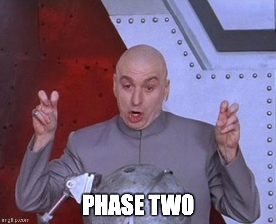

# PHASE TWO (Creating publisher/Subscriber)



## Instructions to Run the Code

### Prerequisites

1. **Docker**: Ensure you have Docker installed on your machine.

### Running the Application

1. **Build and Start the Application**:
   ```bash
   make up
   ```
   To stop the application, you can use the following command:
   ```bash
   make down
   ```

### Testing the System

1. **Start the Alert Subscriber**:
   ```bash
   make sub
   ```
This will subscribe to the queue and wait for market data to be published to the queue, when market data is published, the subscriber will print the market data to the console and use the alert service to create a new alert in the database.

2. **Start the Market Data Publisher**:
   ```bash
   make pub
   ```
   This will:
   - Generate simulated market data
   - Publish price updates every 5 seconds
   - Display current prices in the console

### Accessing the Services

- **API Documentation**: `http://localhost:8000/docs`
- **RabbitMQ Dashboard**: `http://localhost:15672/` (username: guest, password: guest)

## How Alerts Are Created

Alert rules define price thresholds for specific symbols. When a price crosses a threshold:
1. The system detects the crossover direction (above/below)
2. Compares with the previous state to avoid duplicate alerts
3. Creates a timestamped alert with the reason